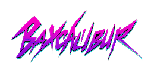

<a name="readme-top">

 

 

  <a href="https://github.com/kentvilg/">
  <!-- TODO: If you want to add logo or banner you can add it here -->
    
  </a>
<!-- TODO: Change Title to the name of the title of your Project -->
  <h3 align="center">Baxcalibur</h3>

<!-- TODO: Make a short description -->

  A cyberpunk-themed tourism web app where users explore high-tech futuristic cities: Vantac-X, Lumina Edge, and Zephyra.

 

<!-- TODO: Change the zyx-0314 into your github username  -->
<!-- TODO: Change the WD-Template-Project into the same name of your folder -->

---

 
 

<!-- TODO: If you want to add more layers for your readme -->

  
Table of Contents

  <ol>
    <li>
      <a href="#overview">Overview</a>
      <ol>
        <li><a href="#key-components">Key Components</a></li>
        <li><a href="#technology">Technology</a></li>
      </ol>
    </li>
    <li><a href="#resources">Resources</a></li>
  </ol>

---

## Overview

<!-- TODO: To be changed -->
<!-- The following are just sample -->

*Baxcalibur* is a futuristic travel booking platform where users can explore three immersive cyberpunk-inspired destinations:
- *Vantac-X*: A neon jungle of vertical cities and holographic skies.
- *LuminaEdge*: A clean tech utopia at the edge of light and innovation.
- *Zephyra*: A wind-powered metropolis hovering among the clouds.

Users can:
- Sign up and log in to their accounts
- View unique travel itineraries for each location
- Book trips
- Cancel bookings
- Pay for their trips

### Key Components

<!-- TODO: List of Key Components -->
<!-- The following are just sample -->

- *Authentication & Authorization*: User account system for signup/login
- *Itinerary Browsing*: Futuristic trip plans per location
- *Booking System*: Book, cancel, and pay for trips
- *Admin & User Dashboards*: Manage bookings and user data
- *Responsive UI*: Styled with cyberpunk aesthetic

### Technology

<!-- TODO: List of Technology Used -->
#### Language

#### Databases

AD-ProjectName
└─ assets
|   └─ css
|   |   └─ name.css
|   └─ img
|   |   └─ name.jpeg/.jpg/.webp/.png
|   └─ js
|       └─ name.js
└─ components
|   └─ name.component.php
|   └─ templates
|      └─ name.component.php
└─ handlers
|   └─ name.handler.php
└─ layout
|   └─ name.layout.php
└─ pages
|  └─ pageName
|     └─ assets
|     |  └─ css
|     |  |  └─ name.css
|     |  └─ img
|     |  |  └─ name.jpeg/.jpg/.webp/.png
|     |  └─ js
|     |     └─ name.js
|     └─ index.php
└─ staticData
|  └─ name.staticdata.php
└─ utils
|   └─ name.utils.php
└─ vendor
└─ .gitignore
└─ bootstrap.php
└─ composer.json
└─ composer.lock
└─ index.php
└─ readme.md
└─ router.php
The following should be renamed: name.css, name.js, name.jpeg/.jpg/.webp/.png, name.component.php(but not the part of the `component.php`), Name.utils.php(but not the part of the `utils.php`)

## Resources

<!-- TODO: Add References -->

| Title        | Purpose                                                                       | Link          |
| ------------ | ----------------------------------------------------------------------------- | ------------- |
| ChatGPT | Help developers write code, understand, and debug quickly and efficiently | chatgpt.com |
| Freepik | Used this website to find images and generate images. | freepik.com |
| W3schools | Web-developer sites that provides free tutorial and reference for learning web technology. | w3school.com |